# Wolfe

Multimodal semantic file search using Jina Embeddings V4, YAMNet, and Whisper Large V3

For intelligently investigating your files

Local only, 100% offline, your data stays on your computer.

### Supported File Types

- Text: UTF-8 text files
- PDF: `.pdf`
- Images: `.bmp`, `.gif`, `.jpeg`, `.jpg`, `.png`, `.tif`, `.tiff`, `.webp`
- Audio: `.aac`, `.flac`, `.m4a`, `.mp3`, `.ogg`, `.opus`, `.wav`, `.webm`
- Video: `.avi`, `.m4v`, `.mkv`, `.mov`, `.mp4`, `.mpeg`, `.mpg`, `.ts`, `.webm`

### Ingestion Diagram

```mermaid
flowchart TD
    A[Input File] --> B{File Type}

    B -->|Text| T[Read Text File]
    T --> T1[Chunk Text]
    T1 --> T2[Embed Text Chunks]
    T2 --> T3[Store Text Records]

    B -->|PDF| P[Extract PDF Text]
    P --> P1[Chunk Text]
    P1 --> P2[Embed Text Chunks]
    P2 --> P3[Store Text Records]
    P --> P4[Render Pages to Images]
    P4 --> P5[Embed Page Images]
    P5 --> P6[Store Image Records]

    B -->|Image| I[Load Image]
    I --> I1[Embed Image]
    I1 --> I2[Store Image Record]

    B -->|Audio| AU[Classify Audio Events through YAMNet]
    AU --> AU1[Build Audio Summary Text]
    AU1 --> AU2[Embed Summary Text]
    AU2 --> AU3[Store Audio Summary Records]
    AU --> AU4{Speech Detected?}
    AU4 -->|Yes| AU5[Whisper Transcription]
    AU5 --> AU6[Chunk Transcription]
    AU6 --> AU7[Embed Transcription Chunks]
    AU7 --> AU8[Store Audio Transcription Records]
    AU5 --> AU9{Non-English + --translate?}
    AU9 -->|Yes| AU10[Whisper Forced English]
    AU10 --> AU11[Chunk Translation]
    AU11 --> AU12[Embed Translation Chunks]
    AU12 --> AU13[Store Translation Records]
    AU --> AU14{Music Detected + --music}
    AU14 -->|Yes| AU15[Qwen Omni Music Characterization]
    AU15 --> AU16[Chunk Description]
    AU16 --> AU17[Embed Description Chunks]
    AU17 --> AU18[Store Music Characterization Records]

    B -->|Video| V[Extract Subtitle Stream]
    V --> V1[Chunk Captions]
    V1 --> V2[Embed Caption Chunks]
    V2 --> V3[Store Caption Records]
    V --> V4[Extract Audio Track]
    V4 --> V5[Audio Pipeline through YAMNet + Whisper]
    V5 --> V6[Store Audio-Derived Records]
    V4 --> V10[Audio Music Characterization --music]
    V10 --> V11[Store Music Characterization Records]
    V --> V7[Extract Keyframes]
    V7 --> V8[Embed Keyframe Images]
    V8 --> V9[Store Keyframe Image Records]
```



## Setup

I would like for Wolfe to be implemented in pure Rust, but currently running the Jina Embeddings V4 model requires the use of a Python wrapper.  Please file a PR or reach out if you know of a way to improve this.  Until then:

### Create a Python venv and install deps

```bash
python3.11 -m venv .venv
source .venv/bin/activate
python -m pip install --upgrade pip
python -m pip install pcre2
python -m pip install "transformers>=4.57,<5" pillow peft requests pymupdf numpy scipy soundfile tensorflow tensorflow-hub optimum auto-gptq gptqmodel --no-build-isolation
```

Install a PyTorch build that matches your hardware:

- CPU fallback:

```bash
python -m pip install torch torchvision
```

- NVIDIA CUDA:

```bash
python -m pip install --no-cache-dir torch==2.8.0 torchvision==0.23.0 torchaudio==2.8.0 --index-url https://download.pytorch.org/whl/cu128
```

- Apple Silicon:

```bash
python -m pip install torch torchvision
```

The helper defaults to `--device auto`, which prefers CUDA, then MPS, then CPU.

### Workaround for pcre

Set up this wrapper for pcre2 as pcre in the .venv

```Python
python - <<'PY'
import site
from pathlib import Path

site_dir = next(p for p in site.getsitepackages() if "site-packages" in p)
shim = Path(site_dir) / "pcre.py"
shim.write_text("from pcre2 import *\n")
print("Wrote shim:", shim)
PY
```

### Ensure model files are present

```bash
curl -sSfL https://hf.co/git-xet/install.sh | sh
git clone https://huggingface.co/jinaai/jina-embeddings-v4
```

or pass `--model-dir`

## Usage

```bash
cargo run -- --path /path/to/input.txt
```

Optional:

```bash
cargo run -- --path /path/to/input-or-directory --model-dir jina-embeddings-v4 --task retrieval --python python3 --db wolfe.lance
cargo run -- --path /path/to/input-or-directory --translate --db wolfe.lance
cargo run -- --path /path/to/input-or-directory --music --db wolfe.lance
cargo run -- --path /path/to/input-or-directory --music --low-memory --db wolfe.lance
```

Flags:
`--translate` runs a second Whisper pass forced to English for non-English audio.
`--music` enables the music characterization step for audio/video when music is detected.
`--low-memory` unloads and reloads Jina, Qwen Omni, and Whisper so only one large model is in VRAM at a time during ingest.

Search:

```bash
cargo run -- --search "error handling in rust" --db wolfe.lance --limit 10
cargo run -- --search "error handling in rust" --db wolfe.lance --range 10:20
cargo run -- --search "error handling in rust" --db wolfe.lance --json
```

Watch for changes:

```bash
cargo run -- --path /path/to/input-or-directory --watch --db wolfe.lance
```

To force a device explicitly:

```bash
cargo run -- --path /path/to/input-or-directory --device cuda
```

### CLI Options

- `-p, --path PATH`: File or directory to embed recursively (conflicts with `--search`).
- `--search TEXT`: Query string to vectorize and search semantically (conflicts with `--path`).
- `--model-dir PATH`: Path to the local model directory (default: `jina-embeddings-v4`).
- `--task TASK`: Embedding task name (default: `retrieval`).
- `--db PATH`: Path to the Lance table directory (default: `wolfe.lance`).
- `--python PATH`: Path to the Python interpreter (default: `python3`).
- `--device DEVICE`: Execution device (`auto`, `cpu`, `cuda`, `mps`) (default: `auto`).
- `--script PATH`: Path to the embedding helper script (default: `scripts/embed.py`).
- `--limit N`: Maximum number of search results to return (default: `10`).
- `--range START:END`: Return a subset of search results (0-based, end-exclusive).
- `--json`: Emit search results as a JSON array instead of tab-separated text.
- `--translate`: For non-English audio, run a second Whisper pass forced to English.
- `--ignore PATH`: File or directory name/path to ignore (repeatable).
- `--ignore-file FILE`: File containing newline-separated ignore entries.
- `--watch`: Watch for changes and keep the index up to date (requires `--path`).

When `--path` points at a directory, the CLI traverses it recursively

You can exclude content from both recursive ingest and `--watch` with repeated `--ignore` arguments or with `--ignore-file path/to/list.txt`. Ignore entries may be file or directory names such as `node_modules` or `target`, or explicit relative/absolute paths. Any file with a matching name and anything under any directory with a matching name or path is skipped.

Embeddings are stored in `wolfe.lance` by default. If `--db` ends with `.lance`, that path is treated as the final Lance table location; otherwise the table name defaults to `wolfe` under the given database directory. Each row includes the vector plus metadata such as absolute file path, file name, extension, parent directory, modality, chunk number, offset, plaintext, file size, and modified timestamp so search results can be mapped back to files. `offset` is stored in bytes for plain text files, seconds for audio-derived records, pages for PDF-derived records, and frames for video-derived records. `plaintext` stores the text input used to create that chunk's embedding when the modality is text-derived. The Python helper stays alive for the whole run, so the model is loaded onto the selected device only once.

In search mode, the query string is embedded by the same Python model helper and searched against the stored vectors in LanceDB. Search results are printed to stdout as tab-separated columns containing the matching path, file name, modality, stored locator (`byte`, `second`, `page`, or `frame`), and the stored `plaintext` snippet for that chunk when available. Use `--range START:END` (0-based, end-exclusive) to return only a subset of results, and `--json` to emit a JSON array instead of tab-separated text. This avoids rerunning Whisper, PDF extraction, or other expensive processing during search.

In `--watch` mode on Linux, Wolfe uses the platform `notify` backend, which is `inotify`, to monitor the target path continuously. Changed and newly created files are reindexed, and removed files are deleted from the database. Existing records for a file are deleted before reindexing so stale chunk rows do not remain. The same ignore rules from `--ignore` and `--ignore-file` are applied to watch events before reindexing.

Video ingestion requires `ffmpeg` and `ffprobe` to be available on `PATH`.

### Todo

- implement semantic boundary detection (sliding window?, llm based?)
- implement multi-threaded pdf decomposition and raster rust-side
- implement multi-threaded video decomposition rust-side
- implement multi-threaded document decomposition for LibreOffice, MS Office rust-side
