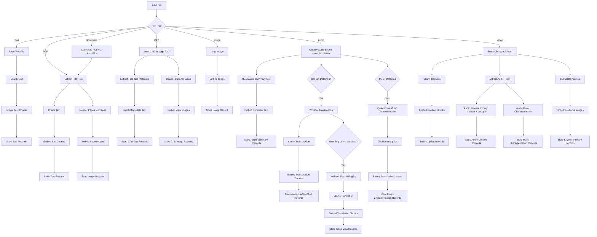

# Wolfe
Multimodal semantic file search for intelligently investigating your files

Local only, 100% offline, your data stays on your computer.

# How it works
Wolfe uses LibreOffice, ffmpeg, mupdf, and F3D to decompose almost any file into streams of audio, text, and images. Audio streams are processed through YAMNet to identify audio events and type. When speech is detected, an additional processing step through Whisper Large v3 is used to transcribe and optionally translate it to text. When music is detected, an additional processing step through Qwen 2.5 Omni 7B is used to characterize and describe the music in text. CAD / 3D files supported by F3D are inspected for textual metadata and rendered into a fixed set of centered orthographic screenshots from the cardinal directions. The resulting streams of images and text are passed through Jina Embedding v4 to generate the embeddings stored in the database with file metadata.

Search text is passed through Jina Embedding v4 to produce an embedding.  When queried with the search embedding, the database returns the closest matches and their associated metadata.

### Supported File Types

- Text: UTF-8 text files
- PDF: `.pdf`
- Document: `.csv` `.dbf` `.dif` `.doc` `.docm` `.docx` `.dot` `.dotm` `.dotx` `.fodg` `.fodp` `.fods` `.fodt` `.htm` `.html` `.mht` `.mhtml` `.odb` `.odc` `.odf` `.odg` `.odm` `.odp` `.ods` `.odt` `.oth` `.otp` `.ots` `.ott` `.otg` `.otm` `.pot` `.potm` `.potx` `.pps` `.ppsm` `.ppsx` `.ppt` `.pptm` `.pptx` `.rtf` `.sda` `.sdc` `.sdd` `.sdw` `.slk` `.sxc` `.sxd` `.sxg` `.sxi` `.sxm` `.sxw` `.tab` `.tsv` `.txt` `.uot` `.uop` `.uos` `.uof` `.vdx` `.vsd` `.vsdx` `.xhtml` `.xls` `.xlsm` `.xlsx` `.xlt` `.xltm` `.xltx` `.xml`
- CAD / 3D: `.3ds` `.gltf` `.glb` `.obj` `.ply` `.stl` `.vtm` `.vti` `.vtk` `.vtp` `.vtr` `.vts` `.vtu` `.wrl` `.x3d`
- Images: `.bmp`, `.gif`, `.jpeg`, `.jpg`, `.png`, `.tif`, `.tiff`, `.webp`
- Audio: `.aac`, `.flac`, `.m4a`, `.mp3`, `.ogg`, `.opus`, `.wav`, `.webm`
- Video: `.avi`, `.m4v`, `.mkv`, `.mov`, `.mp4`, `.mpeg`, `.mpg`, `.ts`, `.webm`

### Ingestion Diagram



## Usage

```bash
cargo run -- --path /path/to/input.txt
```

Optional:

```bash
cargo run -- --path /path/to/input-or-directory --model-dir jina-embeddings-v4 --task retrieval --python python3 --db wolfe.lance
cargo run -- --path /path/to/input-or-directory --translate --db wolfe.lance
cargo run -- --path /path/to/input-or-directory --db wolfe.lance
cargo run -- --path /path/to/input-or-directory --low-memory --db wolfe.lance
cargo run -- --path /path/to/input-or-directory --low-memory --qwen-max-memory 6000 --db wolfe.lance
```

Search:

```bash
cargo run -- --search "error handling in rust" --db wolfe.lance --limit 10
cargo run -- --search "error handling in rust" --db wolfe.lance --range 10:20
cargo run -- --search "error handling in rust" --db wolfe.lance --json
```

Watch for changes:

```bash
cargo run -- --path /path/to/input-or-directory --watch --db wolfe.lance
```

To force a device explicitly:

```bash
cargo run -- --path /path/to/input-or-directory --device cuda
```

CAD / 3D ingest example:

```bash
cargo run -- --path /path/to/cad-or-3d-directory --db wolfe.lance
```

CAD / 3D ingest with watch mode:

```bash
cargo run -- --path /path/to/cad-or-3d-directory --watch --db wolfe.lance
```

Document ingestion for LibreOffice-supported formats requires `soffice` (LibreOffice) to be available on `PATH`.

Video ingestion requires `ffmpeg` and `ffprobe` to be available on `PATH`.

CAD ingestion requires `f3d` to be available on `PATH` with an offscreen rendering backend capable of writing `--output` images. Wolfe extracts text metadata from `f3d --no-render --verbose=debug` output and renders centered orthographic views from the front, back, left, right, top, and bottom directions. If F3D is installed but cannot render offscreen on your machine, CAD files will fail ingest with an F3D backend error.

Music characterization runs when YAMNet flags audio as music. Wolfe sends the audio to Qwen Omni and stores the response as additional audio-derived text chunks for search. The prompt used is:

```text
Fill out this profile about the music you hear. Be thorough.

Instrumentation/Vocals: ""
Soundscape: ""
Mood: ""
Genre: ""
Style: ""
Description: ""
Comment: ""
Progression: ""
Similar works: ""

(Progression means how the song evolves or if there are notable changes or moments.)
```

### CLI Options

- `-p, --path PATH`: File or directory to embed recursively (conflicts with `--search`).
- `--search TEXT`: Query string to vectorize and search semantically (conflicts with `--path`).
- `--model-dir PATH`: Path to the local model directory (default: `jina-embeddings-v4`).
- `--task TASK`: Embedding task name (default: `retrieval`).
- `--db PATH`: Path to the Lance table directory (default: `wolfe.lance`).
- `--python PATH`: Path to the Python interpreter (default: `python3`).
- `--device DEVICE`: Execution device (`auto`, `cpu`, `cuda`, `mps`) (default: `auto`).
- `--script PATH`: Path to the embedding helper script (default: `scripts/embed.py`).
- `--limit N`: Maximum number of search results to return (default: `10`).
- `--range START:END`: Return a subset of search results (0-based, end-exclusive).
- `--json`: Emit search results as a JSON array instead of tab-separated text.
- `--translate`: For non-English audio, run a second Whisper pass forced to English.
- `--low-memory`: Unload/reload Jina, Qwen Omni, and Whisper so only one large model is in VRAM at a time during ingest.
- `--qwen-max-memory MB`: Cap Qwen's GPU usage (MB) when `device_map=auto` is used; lower values offload more to CPU.
- `--ignore PATH`: File or directory name/path to ignore (repeatable).
- `--ignore-file FILE`: File containing newline-separated ignore entries.
- `--watch`: Watch for changes and keep the index up to date (requires `--path`).

## Setup

I would like for Wolfe to be implemented in pure Rust, but currently running the Jina Embeddings V4 model requires the use of a Python wrapper.  Please file a PR or reach out if you know of a way to improve this.  Until then:

### Create a Python venv and install deps

```bash
python3.11 -m venv .venv
source .venv/bin/activate
python -m pip install --upgrade pip
python -m pip install pcre2
python -m pip install "transformers>=4.57,<5" pillow peft requests pymupdf numpy scipy soundfile tensorflow tensorflow-hub --no-build-isolation
```

Install F3D separately and ensure `f3d` is on `PATH` for CAD / 3D ingest.

Install a PyTorch build that matches your hardware:

- CPU fallback:

```bash
python -m pip install torch torchvision
```

- NVIDIA CUDA:

```bash
python -m pip install --no-cache-dir torch==2.11.0 torchvision==0.26.0 torchaudio==2.11.0 --index-url https://download.pytorch.org/whl/cu128
```

- Apple Silicon:

```bash
python -m pip install torch torchvision
```

The helper defaults to `--device auto`, which prefers CUDA, then MPS, then CPU.

### Workaround for pcre

Set up this wrapper for pcre2 as pcre in the .venv

```Python
python - <<'PY'
import site
from pathlib import Path

site_dir = next(p for p in site.getsitepackages() if "site-packages" in p)
shim = Path(site_dir) / "pcre.py"
shim.write_text("from pcre2 import *\n")
print("Wrote shim:", shim)
PY
```

### Ensure model files are present

```bash
curl -sSfL https://hf.co/git-xet/install.sh | sh
git clone https://huggingface.co/jinaai/jina-embeddings-v4
```

or pass `--model-dir`

### Todo

- implement semantic boundary detection (sliding window?, llm based?)
- implement multi-threaded pdf decomposition and raster rust-side
- implement multi-threaded video decomposition rust-side
- implement multi-threaded document decomposition for LibreOffice, MS Office rust-side
