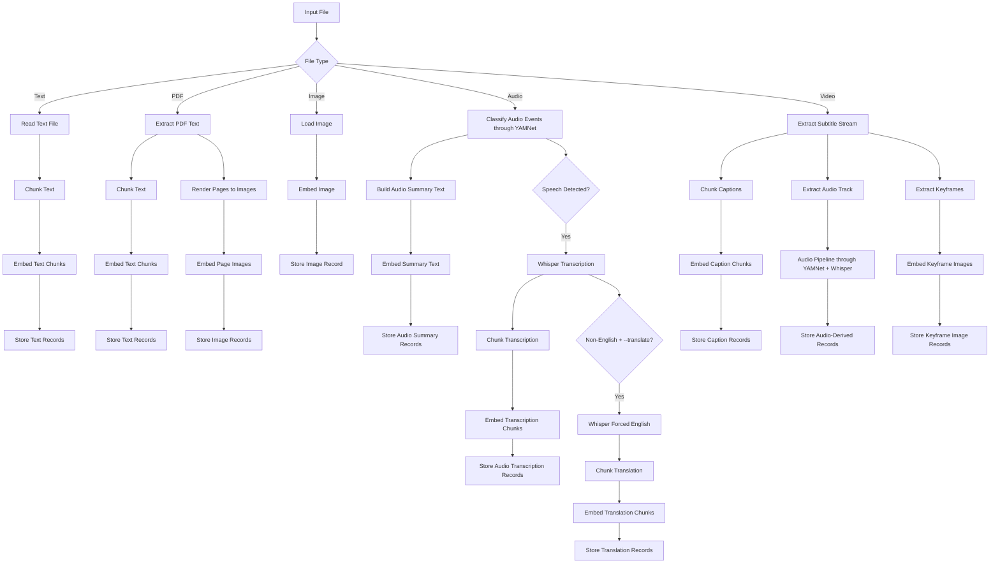

# Ingestion Pathways

```mermaid
flowchart TD
    A[Input File] --> B{File Type}

    B -->|Text| T[Read Text File]
    T --> T1[Chunk Text]
    T1 --> T2[Embed Text Chunks]
    T2 --> T3[Store Text Records]

    B -->|PDF| P[Extract PDF Text]
    P --> P1[Chunk Text]
    P1 --> P2[Embed Text Chunks]
    P2 --> P3[Store Text Records]
    P --> P4[Render Pages to Images]
    P4 --> P5[Embed Page Images]
    P5 --> P6[Store Image Records]

    B -->|Image| I[Load Image]
    I --> I1[Embed Image]
    I1 --> I2[Store Image Record]

    B -->|Audio| AU[Classify Audio Events through YAMNet]
    AU --> AU1[Build Audio Summary Text]
    AU1 --> AU2[Embed Summary Text]
    AU2 --> AU3[Store Audio Summary Records]
    AU --> AU4{Speech Detected?}
    AU4 -->|Yes| AU5[Whisper Transcription]
    AU5 --> AU6[Chunk Transcription]
    AU6 --> AU7[Embed Transcription Chunks]
    AU7 --> AU8[Store Audio Transcription Records]
    AU5 --> AU9{Non-English + --translate?}
    AU9 -->|Yes| AU10[Whisper Forced English]
    AU10 --> AU11[Chunk Translation]
    AU11 --> AU12[Embed Translation Chunks]
    AU12 --> AU13[Store Translation Records]

    B -->|Video| V[Extract Subtitle Stream]
    V --> V1[Chunk Captions]
    V1 --> V2[Embed Caption Chunks]
    V2 --> V3[Store Caption Records]
    V --> V4[Extract Audio Track]
    V4 --> V5[Audio Pipeline through YAMNet + Whisper]
    V5 --> V6[Store Audio-Derived Records]
    V --> V7[Extract Keyframes]
    V7 --> V8[Embed Keyframe Images]
    V8 --> V9[Store Keyframe Image Records]
```
